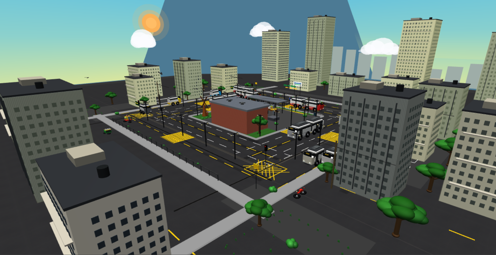
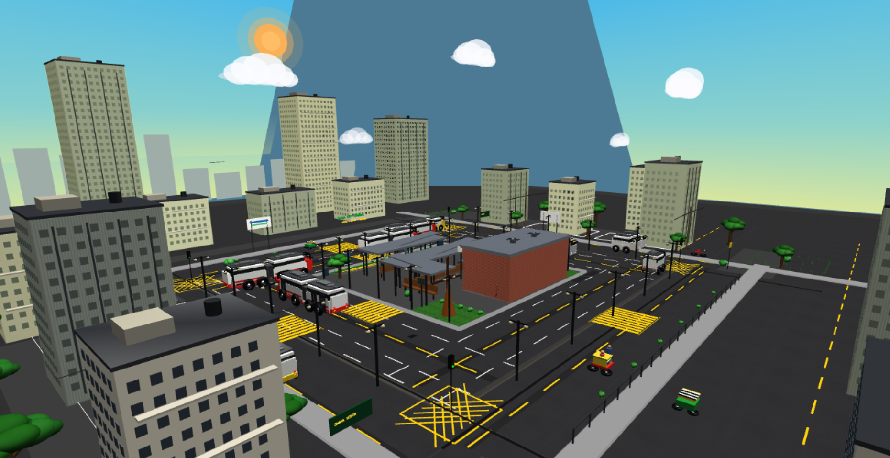
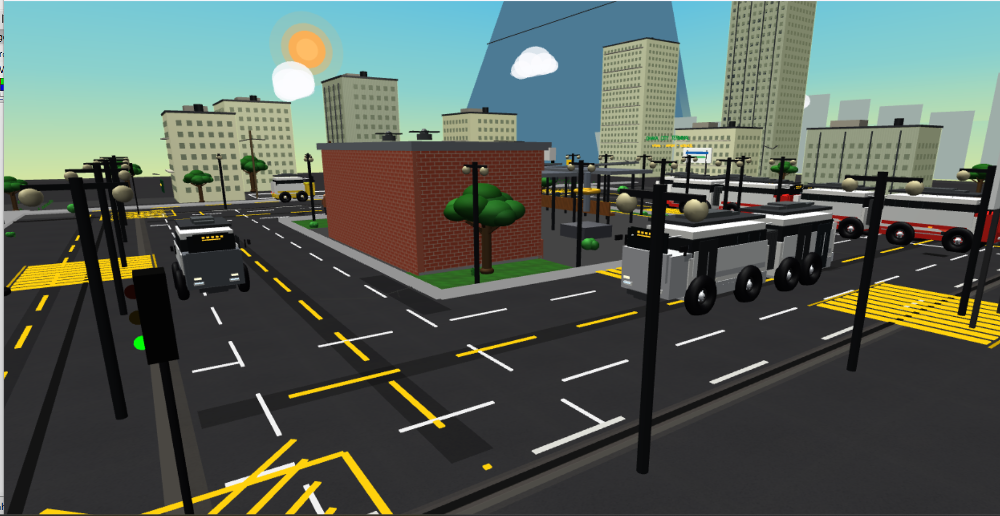
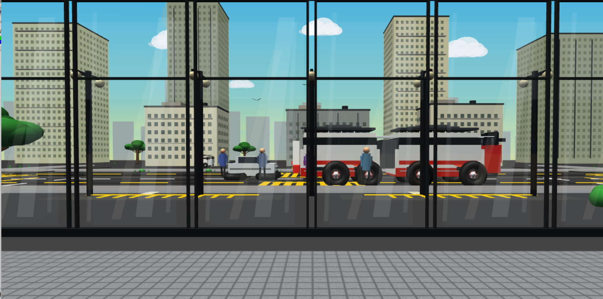

# Smart Transit Terminal Simulation 🚌🏙️

## 🖼️ Project Screenshots

### Day View

### Night View

### Terminal View

### Interior View

An interactive 3D urban city bus terminal environment built using C++ and the fixed-function OpenGL/GLUT pipeline. This project demonstrates core computer graphics concepts including 3D rendering, lighting, procedural texturing, and complex object modeling.

## ✨ Features
- **Fully 3D Environment:** A complete urban transit hub with roads, terminal buildings, landscaping, and vehicles.
- **Dynamic Lighting & Materials:** Implementation of Ambient, Diffuse, and Specular properties with a toggleable Day/Night cycle.
- **Procedural Texturing:** Realistic surfaces (Asphalt, Brick, Wood, Metal, Grass) generated procedurally mathematically without relying on external image files.
- **Complex Objects:** Detailed hierarchical models including modern buses, auto-rickshaws, cycle-rickshaws, and architectural elements.
- **Interactive Transformations:** Real-time Translation, Rotation, and Scaling of specific objects using keyboard and mouse inputs.
- **Continuous Animations:** Automated environment elements like rotating windmills, ceiling fans, swaying trees, moving traffic, and weather (rain) effects.
- **Multiple Camera Views:** 7 distinct camera presets, including a special "interior window view" looking out into the dynamic environment, and an automatic cinematic tour.

## 🎮 Controls

### View / Camera
- `W` / `S` : Move Forward / Backward
- `A` / `D` : Strafe Left / Right
- `Q` / `E` : Move Up / Down
- `Arrow Keys` : Look around (Yaw/Pitch)
- `Left Mouse Drag` : Look around
- `Mouse Wheel` : Zoom / Move Forward/Backward
- `1 - 7` : Camera Presets (Preset 3 is the interior window view)

### Object Transformation (Interactive Monument)
- `J` / `L` : Translate X-axis
- `I` / `K` : Translate Z-axis
- `U` / `O` : Rotate Y-axis
- `+` / `-` : Scale Up / Down
- `Right Mouse Drag` : Rotate and Z-Translate
- `Middle Mouse Drag` : X/Y Translate
- `Ctrl + Mouse Wheel` : Scale Object

### Environment Options
- `N` : Toggle Day / Night Mode
- `P` : Toggle Rain / Dry Weather
- `R` : Play / Pause continuous animations (Windmill, Fans, Trees)
- `M` : Play / Pause vehicle traffic
- `C` : Start / Stop Cinematic Tour
- `H` : Toggle On-Screen HUD
- `X` : Toggle 3D Axes

## 🛠️ Technologies Used
- **Language:** C++
- **Graphics API:** OpenGL (Fixed-Function Pipeline)
- **Library:** GLUT / FreeGLUT

## 🚀 How to Run
1. Ensure you have a C++ compiler and the **OpenGL/GLUT** library installed on your system (e.g., via Code::Blocks, Visual Studio, or MinGW).
2. Clone this repository.
3. Compile the `main.cpp` file linking the necessary OpenGL and GLUT libraries (`-lGL -lGLU -lglut`).
4. Run the generated executable file to explore the simulation.

## 🛠️ Technologies Used

- C++
- OpenGL
- GLUT / FreeGLUT
- Code::Blocks
